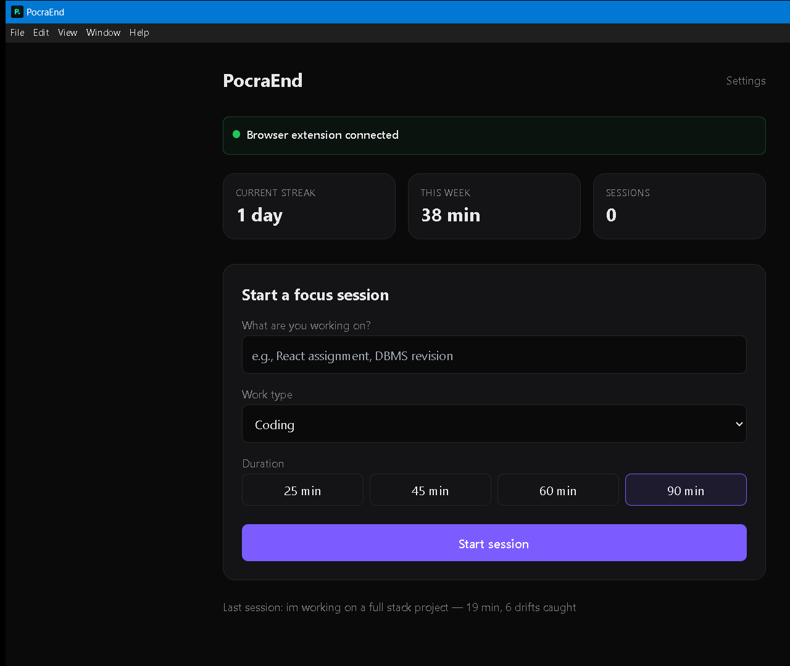
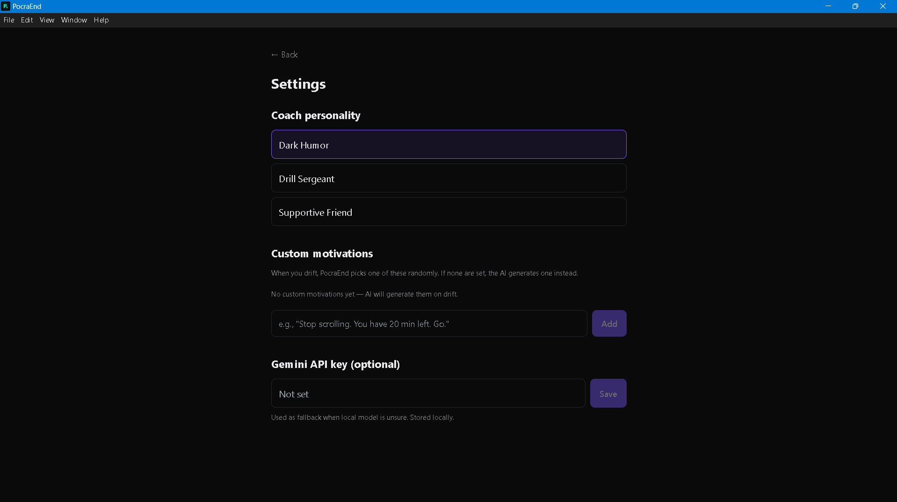

<div align="center">

# PocraEnd

### An AI-powered focus guardian that catches you drifting — in real time.

Tell PocraEnd what you're working on. It watches your tabs and apps, and the
moment you wander off, a **local AI** calls you out — before five minutes of
scrolling becomes fifty. Everything runs on your machine.
*No accounts, no telemetry, no data leaves your computer.*


[Features](#features) · [How It Works](#how-it-works) · [Local LLM Research](#the-local-llm-research) · [Getting Started](#getting-started) · [The Journey](#the-journey-from-first-commit-to-here)

<br><br>



</div>

---

## Screenshots

<table>
  <tr>
    <td width="50%"><br><sub><b>Dashboard</b> — start a focus session</sub></td>
    <td width="50%"><br><sub><b>Focus session</b> — live timer and drift count</sub></td>
  </tr>
  <tr>
    <td width="50%"><br><sub><b>Intervention popup</b> — caught drifting, with attitude</sub></td>
    <td width="50%"><br><sub><b>Settings</b> — coach, AI model, motivations</sub></td>
  </tr>
</table>

---

## Table of Contents

- [The Problem](#the-problem)
- [Features](#features)
- [How It Works](#how-it-works)
- [The Local LLM Research](#the-local-llm-research)
- [Tech Stack](#tech-stack)
- [Getting Started](#getting-started)
- [Choosing & Managing AI Models](#choosing--managing-ai-models)
- [Configuration](#configuration)
- [Testing](#testing)
- [Building for Production](#building-for-production)
- [Project Structure](#project-structure)
- [Privacy](#privacy)
- [Roadmap](#roadmap)
- [The Journey: From First Commit to Here](#the-journey-from-first-commit-to-here)
- [Contributing](#contributing)
- [License](#license)

---

## The Problem

You sit down to work. Twenty minutes later you're three tabs deep in YouTube and
you don't even remember opening it. Willpower fails quietly — by the time you
*notice* you've drifted, the time is already gone.

**PocraEnd is the friend who taps you on the shoulder.** It knows what you're
supposed to be doing, notices the second you stray, and pulls you back before
five minutes becomes fifty.

---

## Features

- **Real-time drift detection** — Watches your active browser tab and desktop app, and decides whether each one is relevant to your stated task.
- **Smart, two-layer classifier** — Deterministic rules handle known sites and apps instantly; a local LLM judges everything ambiguous.
- **Smart interventions** — A distraction triggers a silent 5-second grace timer. Stay too long and a popup appears with three choices: get back to work, snooze, or mark a wrong guess.
- **100% local AI** — Classification runs on [Ollama](https://ollama.com). Your tab titles and URLs never leave your machine.
- **Choose your own model** — A first-run picker offers four AI models with their disk / RAM / accuracy trade-offs and recommends the best fit for your PC. Switch, install, or delete models anytime in Settings.
- **One-click AI setup** — PocraEnd detects, downloads, and installs Ollama and the model for you, with live progress — no terminal required.
- **Optional cloud fallback** — Bring your own Gemini API key for a smarter second opinion on the hardest cases. Entirely opt-in.
- **Three coach personalities** — *Dark Humor* (roasts you with love), *Drill Sergeant* (no nonsense), or *Supportive Friend* (gentle).
- **Custom motivations** — Write your own callout lines, or let the AI generate them on the fly.
- **Session history & stats** — Streaks, weekly minutes, focus score — all stored locally in SQLite.
- **Privacy by design** — No accounts, no analytics, no telemetry. Ever.

---

## How It Works

### The detection layer

PocraEnd never scans your whole screen or every open tab — it only ever looks at
the **one thing in focus**:

- **Browser tabs** — a Manifest V3 Chrome extension reports the *active* tab via
  Chrome's `onActivated`, `onUpdated`, and `onFocusChanged` events. Background
  tabs are invisible to it.
- **Desktop apps** — the main process polls the OS every 1.5 s with `active-win`
  for the single foreground window (it skips browsers, which the extension
  handles with better fidelity).

### The decision flow

```
  ┌─────────────┐     tab / app change     ┌──────────────┐
  │   You start │ ───────────────────────► │   PocraEnd   │
  │  a session  │                          │   watches    │
  └─────────────┘                          └──────┬───────┘
                                                  │
                              ┌───────────────────┴───────────────────┐
                              ▼                                       ▼
                    ┌──────────────────┐                   ┌──────────────────┐
                    │   Rules layer    │   ambiguous?       │    Local LLM     │
                    │ allow / block    │ ─────────────────► │ RELEVANT or      │
                    │ known sites/apps │                    │ DISTRACTION?     │
                    └────────┬─────────┘                    └────────┬─────────┘
                             │                                       │
              ┌──────────────┴──────────────┐         ┌──────────────┴──────────────┐
              ▼                             ▼         ▼                             ▼
         RELEVANT                      DISTRACTION                              RELEVANT
       (do nothing)                 5 s silent timer                         (do nothing)
                                          │
                             still there after 5 s?
                                          │
                                          ▼
                              ┌────────────────────┐
                              │ Intervention popup │
                              └────────────────────┘
```

When the popup appears, you get three buttons:

| Button | What it does |
|---|---|
| **Let's grind** | Closes the offending tab and bumps your focus score. |
| **Waste 5 more minutes** | Snoozes the warning (max 2 snoozes per session). |
| **Wrong guess** | Whitelists this site or app for the rest of the session — the AI got it wrong. |

---

## The Local LLM Research

PocraEnd's hardest problem isn't watching your screen — it's *judging* what it
sees. Whether `youtube.com/watch?v=…` is a distraction depends entirely on the
video and your task. That needs a language model — and PocraEnd runs it
**100% locally**. The real question: **which local model is accurate enough,
small enough, and fast enough?**

### The two-layer classifier

Not every decision needs an LLM. PocraEnd uses two layers:

1. **Deterministic rules** (`allowlist.js`) — known-productive domains
   (`github.com`, `stackoverflow.com`, `react.dev`…) and known work apps
   (VS Code, terminals, Claude, ChatGPT…) are allowed instantly. Known
   time-sinks (`instagram.com`, `tiktok.com`…) are blocked instantly. No model
   call at all.
2. **The LLM** — everything ambiguous (a YouTube tab, a Medium article, an
   unknown app) goes to the local model, together with your stated task, for a
   RELEVANT / DISTRACTION verdict.

Because the rules layer is correct **by construction**, only genuinely ambiguous
cases ever depend on the model.

### The benchmark

`test-accuracy.js` is a reproducible benchmark: **28 hand-labelled real-world
cases** — educational YouTube vs. entertainment, ChatGPT for coding, reddit's
r/reactjs, Netflix, VS Code, Discord, and more — run through the *exact*
production pipeline (rules → LLM). It reports accuracy, **false positives** (real
work wrongly flagged — annoying) and **false negatives** (a real distraction
missed — defeats the purpose).

### Results

| Model | Params | Disk | Accuracy | False positives | False negatives |
|---|---|---|---|---|---|
| `qwen2.5:0.5b` | 0.5 B | ~0.4 GB | 71.4 % | 8 | 0 |
| `qwen2.5:1.5b` | 1.5 B | ~1 GB | 89.3 % | 3 | 0 |
| `qwen2.5:3b` | 3 B | ~1.9 GB | 89.3 % | 3 | 0 |
| `qwen2.5:7b` | 7 B | ~4.7 GB | 92.9 % | 2 | 0 |
| `llama3.2:3b` | 3 B | ~2 GB | 96.4 % | 0 | 1 |
| **`phi3.5`** | **3.8 B** | **~2.2 GB** | **100 %** | **0** | **0** |

### What we learned

- **The 0.5B model is unusable.** It labelled *every* ambiguous case a
  distraction — educational tutorials, ChatGPT, even Microsoft Word. Its "71%"
  came entirely from never saying RELEVANT; it has no real discriminative power.
- **Bigger isn't always better.** The 7B model (4.7 GB) scored *below* `phi3.5`
  and `llama3.2:3b`, both less than half its size *(this was a single benchmark
  run on a modest laptop — a 7B model is heavy and slow on limited hardware, so
  treat its result as indicative, not definitive)*. Either way, it isn't worth
  the extra disk, RAM, and heat for this use case.
- **`phi3.5` won outright** — a perfect 28/28, at a modest 2.2 GB.
- Because the rules layer is deterministic, the entire accuracy spread above is
  the LLM's judgment on hard cases *alone*.

### The outcome

`phi3.5` is the default and recommended model. But hardware varies — so PocraEnd
lets you **choose** (see [Choosing & Managing AI Models](#choosing--managing-ai-models)).

---

## Tech Stack

| Layer | Technology |
|---|---|
| Desktop shell | Electron 33 (Node.js + Chromium) |
| UI | React 18 + Tailwind CSS + Vite |
| Local storage | SQLite via `better-sqlite3` v12 |
| Local AI | Ollama — `phi3.5` by default, user-choosable |
| Cloud AI (optional) | Gemini 1.5 Flash (bring your own key) |
| Browser detection | Chrome Extension (Manifest V3) |
| Desktop app detection | `active-win` |
| App ↔ Extension link | WebSocket server on `127.0.0.1:7842` |

---

## Getting Started

### Prerequisites

1. **[Node.js](https://nodejs.org) 18 or newer**
2. **Windows 10/11** — the only supported platform in v0.1
3. **Google Chrome** — for the browser-tab extension

> **Ollama is installed for you.** You don't need to install Ollama or any AI
> model yourself — on first run, PocraEnd detects what's missing and sets it up
> from inside the app (see step 3).

> **No build tools needed.** `better-sqlite3` and `active-win` ship **prebuilt
> binaries**, so `npm install` works without Visual Studio or Python on any
> current Node.js version (18, 20, 22, or 24 — see `.nvmrc`). A `postinstall.js`
> script automatically fetches the `better-sqlite3` binary that matches your
> Electron version.

### 1. Install PocraEnd

```bash
git clone https://github.com/0xabhilok/PocraEnd.git
cd PocraEnd
npm install
```

> **Windows shortcut:** instead of `npm install`, double-click **`setup.bat`** —
> it checks your Node version, clears any stale install, and installs everything
> in one step.

### 2. Run in development mode

```bash
npm run dev
```

This starts the Vite dev server, the Electron app, the WebSocket server, and the
window watcher together.

### 3. Set up the local AI

On first launch, the onboarding screen lets you **pick an AI model**. Each option
shows its download size, RAM needs, and benchmark accuracy, and PocraEnd marks
the best fit for your computer. Click **Set up** — PocraEnd downloads the
official Ollama installer, runs it, and pulls your chosen model, all with live
progress bars. You can re-run this anytime from the dashboard banner.

### 4. Load the Chrome extension

1. Open Chrome and go to `chrome://extensions`
2. Enable **Developer mode** (top-right toggle)
3. Click **Load unpacked**
4. Select the `chrome-extension/` folder from this repo
5. The extension connects automatically whenever the PocraEnd app is running

---

## Choosing & Managing AI Models

PocraEnd ships with a curated set of local models. Each shows its real
[benchmark](#the-local-llm-research) accuracy, and PocraEnd recommends one based
on your PC's RAM.

| Model | Disk | RAM | Accuracy | Best for |
|---|---|---|---|---|
| `qwen2.5:0.5b` | ~0.4 GB | 3 GB+ | 71 % | Last resort — very old PCs |
| `qwen2.5:1.5b` | ~1 GB | 4 GB+ | 89 % | Low-RAM or older laptops |
| **`phi3.5`** ⭐ | ~2.2 GB | 8 GB+ | 100 % | Recommended for most PCs |
| `llama3.2:3b` | ~2 GB | 8 GB+ | 96 % | Strong alternative |

Change your mind anytime in **Settings → Local AI model**: install another
model, switch the active one, or delete one to reclaim disk space. The active
model can't be deleted until you switch away from it.

---

## Configuration

All settings live in the in-app **Settings** screen (and the first-run onboarding):

- **Coach personality** — Dark Humor, Drill Sergeant, or Supportive Friend.
- **Local AI model** — install, switch, or delete models.
- **Custom motivations** — Add your own callout lines; PocraEnd picks one at
  random on drift, or lets the AI generate one if you've added none.
- **Gemini API key** — Optional. Used only as a fallback when the local model is
  unsure. Stored locally, never synced.

---

## Testing

PocraEnd ships with a small test suite at the repo root:

| Command | What it checks |
|---|---|
| `node test-logic.js` | Unit tests for the session state machine — snooze limits, whitelist, drift reset, per-session resets. |
| `node test-accuracy.js [model]` | Benchmarks the distraction classifier against 28 labelled cases. The rules layer runs offline; the LLM cases need Ollama running. Pass a model name (e.g. `node test-accuracy.js phi3.5`) to benchmark a specific model. |

---

## Building for Production

```bash
npm run build
```

This builds the React renderer and packages the app with `electron-builder`,
producing an NSIS installer in `dist/`. End users just run the installer — they
need no Node.js, no build tools, nothing.

---

## Project Structure

```
pocraend/
├── electron/
│   ├── main/                   Main process (Node.js)
│   │   ├── index.js            Entry — creates window, wires modules
│   │   ├── db.js               SQLite wrapper + schema + migrations
│   │   ├── session-manager.js  In-memory session state
│   │   ├── allowlist.js        Deterministic site/app allow & block rules
│   │   ├── prompts.js          LLM prompt templates
│   │   ├── llm-router.js       Ollama + Gemini calls
│   │   ├── ollama-setup.js     Detect / install Ollama, pull & manage models
│   │   ├── intervention.js     Core brain — detection, timer, popup trigger
│   │   ├── popup-window.js     Manages the intervention popup window
│   │   ├── ws-server.js        WebSocket server for the Chrome extension
│   │   ├── window-watcher.js   Polls the active desktop window
│   │   └── ipc-handlers.js     Bridge: React → main process
│   └── preload/
│       ├── preload.js          Main window IPC bridge
│       └── popup-preload.js    Popup window IPC bridge
├── renderer/
│   ├── index.html              React entry
│   ├── popup.html              Popup window markup
│   └── src/
│       ├── main.jsx            React root
│       ├── App.jsx             Page router
│       ├── modelCatalog.js     The choosable AI models + recommendations
│       ├── components/         OllamaSetup, ModelManager, ExtensionStatus
│       └── pages/              Onboarding, Dashboard, Session, Summary, Settings
├── chrome-extension/           Manifest V3 extension (tab detection)
├── postinstall.js              Fetches the better-sqlite3 binary for Electron
├── setup.bat                   One-click Windows setup
├── test-accuracy.js            Classifier accuracy benchmark
├── test-logic.js               Session-logic unit tests
└── package.json
```

---

## Privacy

PocraEnd is built privacy-first:

- All session data is stored locally in SQLite at `%APPDATA%/PocraEnd/pocraend.db`.
- Tab titles and URLs are sent **only to your local Ollama instance** by default.
- The Gemini API key is **optional**. If you set it, only low-confidence
  classifications are sent to Google for a second opinion.
- **No telemetry, no analytics, no accounts.**

---

## Roadmap

**Known limitations in v0.1**

- Windows only
- Chrome only for browser detection
- One coach personality at a time (no per-session switching)
- No streak forgiveness — one missed day resets the streak

**Planned for v0.2**

- Stillness / daydream detection
- Prompt-to-task AI to-do generation
- macOS support

---

## The Journey: From First Commit to Here

> Every version of PocraEnd, in order — built across a single intense day,
> **2026-05-21**. Each entry maps to a real commit.

### Before v0.1.0 — Focus-Guardian

PocraEnd grew out of an earlier project of mine:
**[Focus-Guardian](https://github.com/0xabhilok/Focus-Guardian)** — a
Windows productivity monitor written in PowerShell that tracked app usage
and classified activity as productive or distracted. PocraEnd is that idea
taken further: instead of monitoring and reporting *after the fact*, it
understands your task with a local LLM and steps in *in the moment*. Same
goal — beat procrastination — but rebuilt from scratch as a proper
Electron + React + browser-extension desktop app. This project is the
direct successor to, and was inspired by, Focus-Guardian.

### v0.1.0 — Initial build · `3a302d8`, `c67e1f5`

The first working version: an Electron + React desktop app that watches your
active window and browser tab, classifies each with a local LLM, and shows an
intervention popup when you drift. Shipped with `qwen2.5:0.5b` as the classifier
and a structured README.

### Polishing the rough edges · `1cf80cd`, `3cbd995`

Two early UX bugs:

- The dashboard's "what are you working on?" field validated with a native
  `alert()`. Dismissing the alert with **Enter** re-triggered the Start button —
  an annoying loop. Replaced it with **inline validation**.
- DevTools opened automatically on every launch. **Removed.**

### The native-module saga · `364f9b3`, `f7a1d64`, `4fb43e0`, `e5c315f`

The toughest stretch. The app refused to install on a second laptop:

- **The crash.** `better-sqlite3` (the database) is compiled C++. On Node 24 no
  prebuilt binary existed, so npm tried to compile from source — which needs
  Visual Studio. It failed.
- **First fix.** Pinned the Node version with `.nvmrc` / `engines` and added a
  one-click `setup.bat`.
- **Real fix.** Upgraded `better-sqlite3` v11 → v12, which ships Node 24
  binaries. `npm install` worked again.
- **The next crash.** The Electron app then failed with a `NODE_MODULE_VERSION`
  mismatch — the binary was built for *system* Node, but Electron bundles its
  own Node with a different ABI.
- **The final fix.** A `postinstall.js` script that automatically fetches the
  `better-sqlite3` binary matching the installed Electron. Result: PocraEnd
  installs on any modern Node, with **zero build tools**, forever.

### Automatic Ollama setup · `6075912`, `e8d8f8b`

Originally users had to install Ollama and pull the model by hand. Replaced with
in-app detection and **one-click setup**: PocraEnd downloads the official Ollama
installer, runs it, waits for it to come online, and pulls the model — all with
live progress bars, from onboarding or a dashboard banner.

### The hardening pass · `e29c6fb`

A full automated test pass — boot test, unit tests, and a code review — surfaced
**8 bugs**, all fixed in one sweep:

1. **Popup storm** — if Ollama was unavailable, every window switch was
   classified as a distraction. Now it stays quiet instead of nagging.
2. **reddit / discord false positives** — both were hard-blocked, even though
   r/reactjs or a dev server can be on-topic. Moved to LLM judgment.
3. **Drift blind spot** — alt-tabbing back into an already-open distraction tab
   wasn't caught. Fixed with a `windows.onFocusChanged` listener.
4. **Streak timezone bug** — the daily-streak counter mixed UTC and local time.
5. **Extension count inflation** — duplicate WebSocket connections piled up.
   Added a connect-guard and a server-side heartbeat.
6. **Dead setting** — `default_duration_min` was stored but never used. Wired it
   up so your duration choice now sticks.
7. **"Wrong guess" did nothing for desktop apps** — added a per-app session
   whitelist.
8. **Onboarding** — added missing error handling.

This phase also added the test suite (`test-logic.js`, `test-accuracy.js`).

### The accuracy crisis · `928794c`

A user reported PocraEnd flagging the **Claude desktop app** as a distraction
during a coding project. Investigation revealed the `qwen2.5:0.5b` model was
flagging *almost everything*. Fixes:

- Added a **desktop-app allow-list** — Claude, VS Code, Cursor, terminals, etc.
  are never flagged.
- Allow-listed AI assistant websites (`claude.ai`, `chatgpt.com`, …).
- Kicked off the [local LLM research](#the-local-llm-research) and upgraded the
  default model.

### Choosable AI models · `c8bf0f8`

After benchmarking six models, the model became fully **user-controlled**: a
first-run picker with disk / RAM / accuracy details and a device-based
recommendation, plus a Settings panel to install, switch, and delete models. The
active model moved into the database with a safe schema migration.

### Where it is now

PocraEnd installs with zero build tools on any modern Node, sets up its own AI,
lets you pick the model that fits your machine, and classifies distractions at up
to **100%** on the benchmark — from a buggy first commit to a polished,
self-installing focus guardian, in thirteen commits.

---

## Contributing

Issues and pull requests are welcome. If you're planning a larger change, please
open an issue first to discuss it. Run `node test-logic.js` and
`node test-accuracy.js` before submitting.

---

## License

[MIT](LICENSE) © 2026

<div align="center"><sub>Built to end procrastination — one caught drift at a time.</sub></div>
